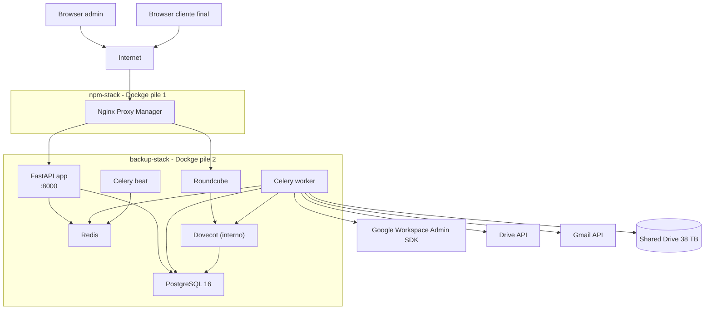
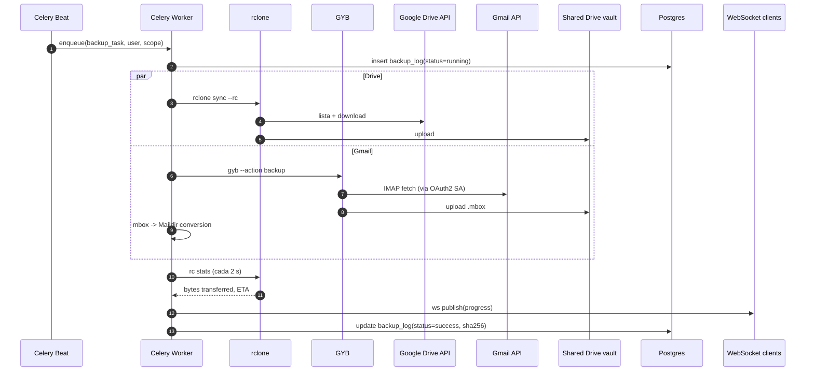
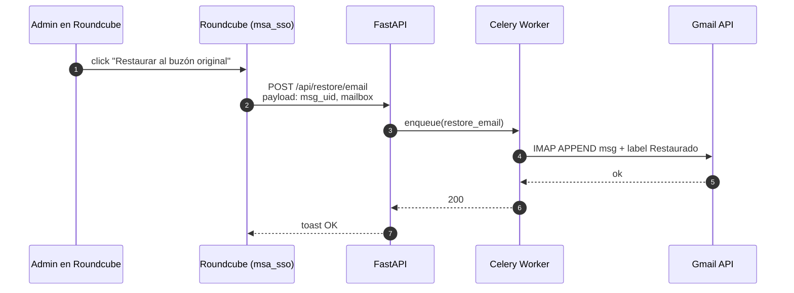

# Arquitectura

```mermaid
graph TB
  user[Browser admin]
  client[Browser cliente final]
  internet[Internet]

  subgraph npmStack [npm-stack - Dockge pile 1]
    npm[Nginx Proxy Manager]
  end

  subgraph backupStack [backup-stack - Dockge pile 2]
    app["FastAPI app<br/>:8000"]
    worker[Celery worker]
    beat[Celery beat]
    redis["Redis"]
    postgres["PostgreSQL 16"]
    dovecot["Dovecot (interno)"]
    roundcube["Roundcube"]
  end

  gcp[Google Workspace Admin SDK]
  drive[Drive API]
  gmail[Gmail API]
  vault[(Shared Drive 38 TB)]

  user --> internet --> npm
  client --> internet
  npm --> app
  npm --> roundcube

  app --> postgres
  app --> redis
  worker --> postgres
  worker --> redis
  worker --> gcp
  worker --> drive
  worker --> gmail
  worker --> vault
  beat --> redis
  roundcube --> dovecot
  dovecot --> postgres
  worker --> dovecot
```

## Flujo de backup (diario)

```mermaid
sequenceDiagram
  autonumber
  participant beat as Celery Beat
  participant worker as Celery Worker
  participant rclone as rclone
  participant gyb as GYB
  participant drive as Google Drive API
  participant gmail as Gmail API
  participant vault as Shared Drive vault
  participant db as Postgres
  participant ws as WebSocket clients

  beat->>worker: enqueue(backup_task, user, scope)
  worker->>db: insert backup_log(status=running)
  par Drive
    worker->>rclone: rclone sync --rc
    rclone->>drive: lista + download
    rclone->>vault: upload
  and Gmail
    worker->>gyb: gyb --action backup
    gyb->>gmail: IMAP fetch (via OAuth2 SA)
    gyb->>vault: upload .mbox
    worker->>worker: mbox -> Maildir conversion
  end
  worker->>rclone: rc stats (cada 2 s)
  rclone-->>worker: bytes transferred, ETA
  worker->>ws: ws publish(progress)
  worker->>db: update backup_log(status=success, sha256)
```

## Flujo de restore (email único)

```mermaid
sequenceDiagram
  autonumber
  participant admin as Admin en Roundcube
  participant rc as Roundcube (msa_sso)
  participant api as FastAPI
  participant worker as Celery Worker
  participant gmail as Gmail API

  admin->>rc: click "Restaurar al buzón original"
  rc->>api: POST /api/restore/email<br/>payload: msg_uid, mailbox
  api->>worker: enqueue(restore_email)
  worker->>gmail: IMAP APPEND msg + label Restaurado
  gmail-->>worker: ok
  worker-->>api: 200
  api-->>rc: toast OK
```
